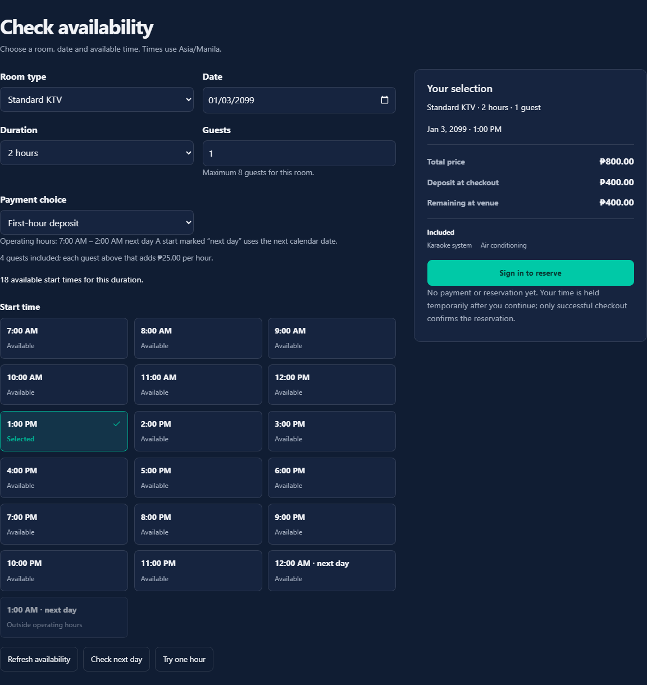
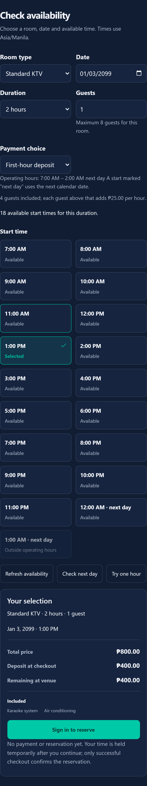
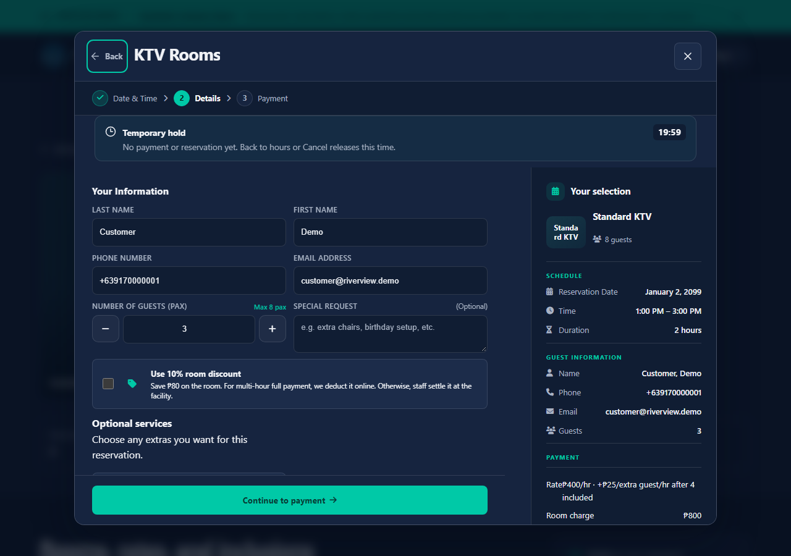
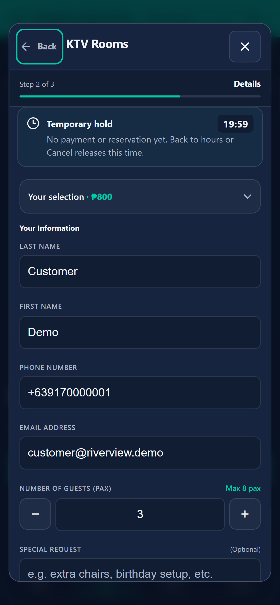
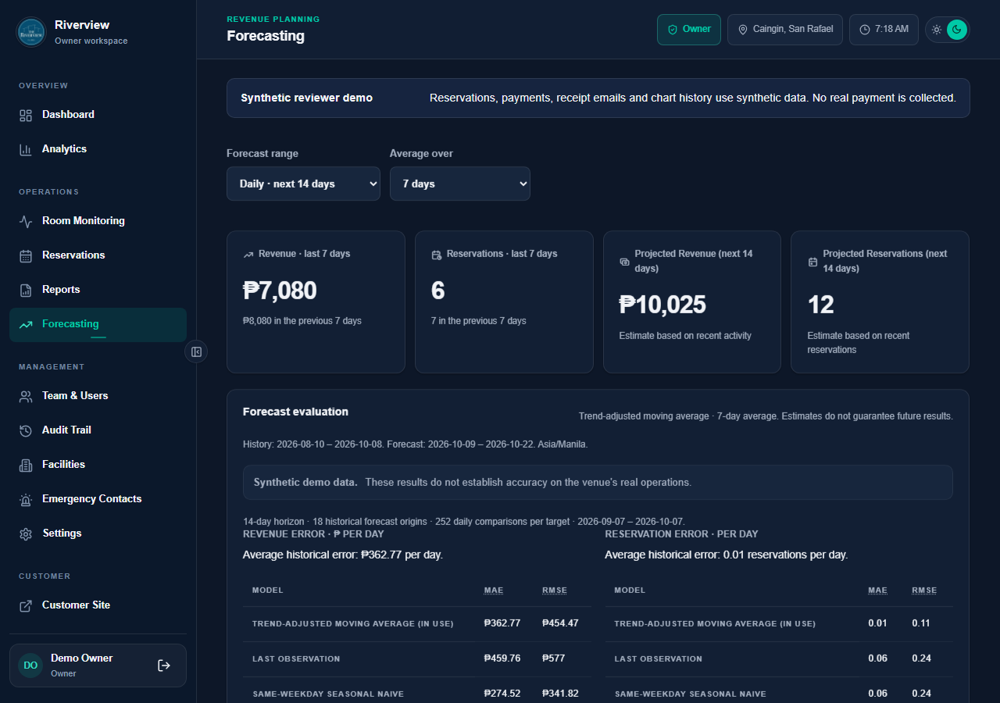
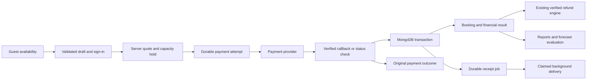

# The Riverview

A reservation and venue operations app for The Riverview's KTV rooms, billiards, and basketball facilities, with guest availability, online checkout, staff operations, and payment reconciliation.

**[Public frontend](https://the-riverview.vercel.app)** · **[Local customer/admin walkthrough](docs/reviewer-walkthrough.md)** · **[API contract](backend/docs/api/openapi.json)** · **[Security and verification limits](SECURITY.md)**

The public frontend responded successfully on October 7, 2026. These checkout improvements have been verified locally; this review did not deploy them. The admin walkthrough uses an isolated local demo with synthetic accounts and data.

The project addresses shared facility capacity, hourly and overnight schedules, deposits, staff room sessions, and payments that can succeed before a reservation is confirmed. MongoDB transactions enforce inventory; the server calculates prices and verifies payment evidence. A durable payment record preserves the original outcome when a received payment cannot produce a reservation.

**Role: solo developer.** Responsibilities include the React customer/admin interfaces, Express APIs, reservation/pricing rules, cookie sessions and role permissions, provider integration, financial reporting, failure recovery, tests, and reviewer setup. No adoption, revenue growth, or time-saving claims are inferred from the demo.

- Customers can check slots/prices before signing in, restore a selected draft, complete checkout and inspect reservations/receipts.
- Staff can find bookings, operate room sessions and inspect reservation details. Supervisors and owners can use the existing authorized booking refund workflows.
- Forecasts compare rolling-origin results with simple baselines, show insufficient history honestly, and label the variability range as heuristic.

## Actual interface

These five captures show the implemented local app with synthetic data. Availability captures isolate the complete panel, temporarily hiding surrounding navigation during capture; reservation and admin captures show the current viewport. Demo financial actions are read-only.

Guest availability, desktop: whole-hour slots, guest count, and the deposit/full-payment summary.



The same availability flow at a 390px mobile width.



Guest details with a temporary hold. The selected time is not reserved until checkout succeeds.



The same hold and guest details on mobile.



Forecast evaluation on synthetic history. These results do not establish accuracy on real venue operations.



## Try the isolated demo

Requires Node.js **22.12+** and npm. From the repository root:

```powershell
npm ci --prefix backend
npm ci --prefix frontend
npm run demo --prefix backend
```

Open [http://127.0.0.1:5501](http://127.0.0.1:5501). The launcher starts a disposable single-node MongoDB replica set, seeds it, and starts the API and Vite. Ports `27028`, `3000`, and `5501` must be free. The first run downloads MongoDB **8.2.6**; the Windows binary was approximately 782 MB. Later runs use its cache. `MONGOMS_VERSION` can explicitly select a compatible binary.

| Local demo account | Role |
| --- | --- |
| `customer@riverview.demo` | Customer |
| `staff@riverview.demo` | Staff |
| `supervisor@riverview.demo` | Supervisor (`manager`) |
| `owner@riverview.demo` | Owner (`super_admin`) |

All four use **`Evaluate2026!`**, only in this synthetic environment. Sign in at `/login`; staff roles can open `/admin`. Follow the [reviewer task script](docs/reviewer-walkthrough.md).

The seed contains three facilities, confirmed bookings, an active room session, receipt attention, a closure, and 400 days of synthetic historical coverage with deliberate zero-activity days. Upcoming dates are relative to seed time. A simulated payment passes through the real booking transaction and receipt queue. No provider or SMTP service is contacted. Google login/uploads and existing booking refund mutations are blocked by the server; those financial controls are also disabled in the interface.

The launcher does not load application `.env` files and refuses external-service credentials inherited from the shell. Frontend demo configuration clears public API/OAuth overrides. Demo mode is restricted to development and a local `riverview_demo_*` database; it grants no production permissions.

If another local API occupies port 3000, set `$env:DEMO_API_PORT = '3001'` before launching the demo or browser suite. The demo proxy follows that port. Browser tests require the synthetic API and seeded facility before signing in. Remove the variable afterward with `Remove-Item Env:DEMO_API_PORT`.

### Seed and reset

The launcher prints its owned demo URI. In a second terminal, use that exact URI while the demo runs:

```powershell
$env:DEMO_MONGO_URI = 'mongodb://127.0.0.1:27028/riverview_demo_local?replicaSet=riverview-demo'
npm run demo:seed --prefix backend
npm run demo:reset --prefix backend
Remove-Item Env:DEMO_MONGO_URI
```

Seed is idempotent for existing synthetic records. Reset drops/reseeds only the validated local demo database carrying its `_demo_meta` ownership marker; populated unowned databases are refused. It refreshes dates, offers and examples. The default database is disposable: `Ctrl+C` stops the launcher and removes temporary replica-set data. An explicitly supplied `DEMO_MONGO_URI` is retained for later seed/reset; use a dedicated local replica set and the required name prefix. Both seed and reset were exercised against the owned demo database.

## Architecture and ownership

React 18, React Router, Vite, Express 5, Mongoose/MongoDB, cookie sessions, Cloudinary, Gmail SMTP, PayMongo, optional Xendit, ExcelJS and Recharts remain the stack. Tests use Node's runner, Vitest/Testing Library, Playwright, and a disposable MongoDB replica set.



| Responsibility | Authoritative modules |
| --- | --- |
| Inventory, transactions, capacity and quotes | [bookingHelper.js](backend/utils/bookingHelper.js), [bookingSchedule.js](backend/utils/bookingSchedule.js), [roomPricing.js](backend/utils/roomPricing.js) |
| Lifecycle, recorded balances and refunds | [bookingLifecycle.js](backend/utils/bookingLifecycle.js), [closureRefunds.js](backend/utils/closureRefunds.js) |
| Provider evidence and stable checkout outcome | [paymentAttempts.js](backend/utils/paymentAttempts.js), [paymentReconciliation.js](backend/utils/paymentReconciliation.js), [paymongoRoutes.js](backend/routes/paymongoRoutes.js) |
| Roles and authoritative identity | [permissions.js](backend/utils/permissions.js), [adminAuth.js](backend/middleware/adminAuth.js), [AuthContext.jsx](frontend/src/context/AuthContext.jsx) |
| Business dates and financial reporting | [businessDate.js](backend/utils/businessDate.js), [salesReport.js](backend/utils/salesReport.js) |
| Shared limits and distributed work | [rateLimitStore.js](backend/utils/rateLimitStore.js), [jobLease.js](backend/utils/jobLease.js), [reservationJobs.js](backend/utils/reservationJobs.js) |
| Receipt/notification delivery | [receiptOutbox.js](backend/utils/receiptOutbox.js), [reservationNotifications.js](backend/utils/reservationNotifications.js) |
| Forecast model and rolling-origin comparison | [forecastEvaluation.js](backend/utils/forecastEvaluation.js), [forecastRoutes.js](backend/routes/forecastRoutes.js) |

[BookingModal.jsx](frontend/src/components/BookingModal.jsx) coordinates the flow. Its [step components](frontend/src/components/booking) own facility/schedule/guest input, checkout, verification, summary and confirmation rendering. [bookingFlow.js](frontend/src/utils/bookingFlow.js) defines allowed transitions. Focused hooks/utilities own availability, hold lifetime, checkout identity, polling and validated drafts; provider orchestration stays out of step components. Refresh resumes the original eligible unpaid checkout without creating a second provider intent.

Admin booking/cancellation forms and monitor dialogs live in [components/admin](frontend/src/components/admin). [services/api.js](frontend/src/services/api.js) centralizes credentials, cancellation, deadlines and structured errors.

## Normal development setup

Normal environments need MongoDB as a **replica set**, or Atlas supporting transactions. A standalone server cannot provide reservation transactions. After installing both packages, copy templates only if no local file exists:

```powershell
if (!(Test-Path backend/.env)) { Copy-Item backend/.env.example backend/.env }
if (!(Test-Path frontend/.env)) { Copy-Item frontend/.env.example frontend/.env }
```

Set `MONGO_URI` and `SESSION_SECRET` in `backend/.env`. Generate a secret with:

```powershell
node -e "console.log(require('node:crypto').randomBytes(32).toString('hex'))"
```

Start the API and frontend in separate terminals:

```powershell
npm start --prefix backend
```

```powershell
npm run dev --prefix frontend
```

Open [http://localhost:5501](http://localhost:5501). Vite proxies `/api` to port `3000`; [http://localhost:3000](http://localhost:3000) reports API/database status. For production preview, keep the API running, stop Vite development, then run:

```powershell
npm run build --prefix frontend
npm run preview --prefix frontend
```

Preview uses the same port/proxy. Update both targets in `frontend/vite.config.js` if changing the backend port.

### Configuration

| Backend variables | Required for |
| --- | --- |
| `MONGO_URI`, `SESSION_SECRET` | Startup, database and sessions |
| `NODE_ENV`, `PORT` | Runtime; local values `development`, `3000` |
| `APP_BASE_URL` | Exact permitted frontend origins, comma-separated, without paths/trailing slashes |
| `APP_PUBLIC_URL` | Optional public frontend URL for notification links |
| `GMAIL_USER`, `GMAIL_APP_PASSWORD` | Verification, recovery, real receipt/notification email |
| `GOOGLE_CLIENT_ID`, `GOOGLE_CLIENT_SECRET` | Optional Google authentication |
| `CLOUDINARY_CLOUD_NAME`, `CLOUDINARY_API_KEY`, `CLOUDINARY_API_SECRET` | Image/proof uploads |
| `PAYMONGO_SECRET_KEY`, `PAYMONGO_PUBLIC_KEY`, `PAYMONGO_WEBHOOK_SECRET` | PayMongo checkout and callbacks |
| `PAYMONGO_RETURN_BASE_URL`, `PAYMONGO_API_BASE` | Frontend return URL and optional endpoint override |
| `XENDIT_SECRET_KEY`, `XENDIT_WEBHOOK_TOKEN`, `XENDIT_RETURN_BASE_URL` | Optional Xendit fallback; return URL must be HTTPS |
| `CRON_SECRET` | External reservation-job trigger |

Production requires an explicit `APP_BASE_URL` and a session secret of at least 32 characters. Gmail is needed for normal email registration/recovery; other integrations are required for their respective features. Uncertain PayMongo writes never trigger Xendit fallback: fallback is chosen only before a provider write when PayMongo is not configured.

| Frontend variables | Purpose |
| --- | --- |
| `VITE_API_URL` | Empty for same-origin Vite proxy/Vercel rewrite |
| `VITE_GOOGLE_CLIENT_ID` | Optional public OAuth ID matching the backend; absent configuration hides Google login and avoids SDK loading |
| `VITE_PAYMONGO_API_BASE` | Optional public endpoint override; default `https://api.paymongo.com/v1` |

`VITE_` values are public and require rebuilding when changed. Never put backend secrets in them. Register the exact frontend origin in the Google dashboard. `APP_MODE=demo`, `DEMO_MONGO_URI` and `VITE_DEMO_MODE=true` are local launcher settings; frontend flags grant no server permissions. Optional `TEST_MONGO_URI` is an explicitly separate local disposable test database; tests never default to `MONGO_URI`.

### First owner in a normal environment

There are no default production accounts. Register the intended owner and complete email verification. An authorized database administrator can promote that one verified account with `mongosh`:

```javascript
db.users.updateOne(
  { email: "owner@example.test", isVerified: true, isActive: true },
  { $set: { role: "super_admin", sessionVersion: UUID().toString() } }
);
```

Replace the synthetic email, confirm exactly one intended account changed, and sign in again. Direct database updates bypass model save hooks, so the new string session stamp invalidates previous sessions. Admin-created staff accounts are verified; public customer registration still requires verification.

Roles are customer (`user`), staff, Supervisor (`manager`), and Owner (`super_admin`). API permissions enforce hierarchy. Staff operate bookings/rooms; financial actions require explicit permissions available to supervisors/owners. The existing eight-hour staff and longer customer session policies remain in `sessionPolicy.js`.

## Reservation, payment and recovery rules

- Online bookings retain whole-hour starts, durations of 1–5 hours, operating hours/closures, deposits/full payment, configured fees/add-ons/discounts, and **Asia/Manila** service dates, including overnight intervals.
- Availability units (`roomCount`) differ from guest capacity. Known capacity is validated; unknown capacity has a staff-contact action. Zero included guests explicitly means the guest fee applies to every guest.
- Public availability exposes aggregated inventory/quotes and creates no anonymous hold. Validated drafts expire after two hours and are rechecked after sign-in.
- Checkout is persisted before a provider write. PHP amounts use integer centavos. Callback and browser verification converge on one booking/receipt transaction; evidence must match amount, currency, customer and payment association.
- Uncertainty retains the original attempt and offers a customer status check under `/api/payments/paymongo/attempts`. Ownership is required; eligible refreshes resume the original checkout. Unresolved attempts are never automatically charged again.
- A received payment without a confirmed reservation retains its original evidence. The customer sees the payment reference and venue contact options. No second charge or reservation is invented.
- Existing booking refunds reuse `closureRefunds.js`; already queued historical attempt refunds retain their processing safeguards. Status checks never submit. Preparation retry requires proof that nothing was submitted. Evidence must match the original request/payment/currency/amount before totals change.
- Receipt jobs are saved atomically with booking confirmation. SMTP failure leaves the booking confirmed and receipt accessible. Five automatic attempts use exponential backoff from one minute to one hour; automatic delivery stops after five unsuccessful attempts; the account receipt remains accessible. Delivery is **at least once**, with deduplication and stable Message-ID.
- A temporary checkout hold creates no booking or payment. Before payment submission, returning to the hours picker or closing the reservation releases it; abandoned holds expire after 20 minutes. A successfully confirmed reservation occupies its scheduled interval independently of the hold. An unresolved submitted payment keeps its original recovery safeguards.

### Additive indexes and existing records

New collections are `PaymentAttempt`, `ReceiptJob`, `RateLimitCounter` and `JobLease`; notifications gain durable delivery fields. The API waits for critical reservation/payment/outbox indexes before traffic. Startup needs index-creation permissions and reviewed existing data.

Constraints include unique attempt flow/customer-client keys, partial provider intent/payment IDs, receipt deduplication and shared counter IDs. Existing booking payment uniqueness and inventory counters remain authoritative. TTL cleanup is separate from immediate logical hold/counter expiry.

No destructive migration or bulk financial backfill is required. Existing Xendit attempts have read-through compatibility. Historical paid PayMongo callbacks can link matching recorded bookings without rewriting the ledger; lacking a trustworthy original reservation snapshot, their original payment outcome is retained for customer recovery and venue contact. Historical unpaid PayMongo resources without a stored attempt need dashboard reconciliation. Investigate index collisions before rollout; do not drop real records to force startup.

## Forecast evidence

Targets use existing net-collected sales and booking definitions on Manila service dates. Refunds/cancellations follow reporting rules; missing historical dates are explicit zero-activity days. Consecutive training prefixes exclude future observations and compare the moving-average/trend model with last-observation and same-weekday baselines.

Supported horizons are **14 days**, **8 weeks (56 days)** and **6 months (180 days)**. MAE/RMSE, folds/samples, model version, training window, target, date coverage and evaluation time are returned. Work is capped at 18 folds and cached for five minutes. Short histories return insufficient evidence; synthetic results remain labeled. The UI recommends a better baseline when appropriate. The range is heuristic variability, not calibrated confidence. Historical ledger revisions use currently recorded refunds rather than reconstructing financial state at each past origin.

## API documentation

Open [http://localhost:3000/api/docs/](http://localhost:3000/api/docs/) with the API running, or inspect [openapi.json](backend/docs/api/openapi.json): **56 paths, 68 operations**. The bundled viewer needs no third-party documentation service.

The contract documents cookie sessions, origin checks, permissions, Joi validation, examples/errors, provider callbacks, cron authentication, availability/holds, bookings, payments/refunds, monitoring, reporting and forecasts. Drift checks compare actual route middleware, validation descriptions and handler/domain-source hashes, validate request examples against runtime Joi, and check structural/path/security references. This is a focused checker, not external OpenAPI certification.

```powershell
npm run docs:check --prefix backend
```

After an intentional API change, review the implementation/schemas/descriptions, update and check:

```powershell
node backend/scripts/checkApiDocs.js --update
npm run docs:check --prefix backend
```

Example anonymous availability against the seeded demo:

```powershell
Invoke-RestMethod 'http://127.0.0.1:5501/api/bookings/slots?roomId=de0000000000000000000015&variantLabel=Standard%20KTV&date=2099-01-02&duration=2&guestCount=3'
```

## Tests and CI

Install Chromium once for browser checks:

```powershell
cd frontend
npx playwright install chromium
cd ..
```

| Command, from repository root | Latest local result |
| --- | --- |
| `npm run check --prefix backend` | **118 source files passed** |
| `npm run lint --prefix backend` | **Passed, 0 errors / 0 warnings** |
| `npm run lint --prefix frontend` | **Passed, 0 errors / 22 legacy hook warnings** |
| `npm run test:unit --prefix backend` | **92 passed** |
| `npm run test --prefix frontend` | **63 Node unit + 27 Vitest component tests passed** |
| `npm run test:integration --prefix backend` | **29 passed** on a real disposable replica set |
| `npm run test:e2e --prefix frontend` | **18 passed** across the 16 existing checks and 2 focused callback regressions, fresh demo / desktop/mobile Chromium |
| `npm run docs:check --prefix backend` | **Passed, 56 paths / 68 operations** |
| `npm run build --prefix frontend` | **Passed, Vite 8.2.1** |
| `npm audit --prefix backend --audit-level=moderate` | **0 vulnerabilities**, including development dependencies |
| `npm audit --prefix frontend --audit-level=moderate` | **0 vulnerabilities**, including development dependencies |

Unit/components cover pricing/calendars/overnight intervals, auth/logout failures and races, UI transitions, PayMongo popup returns, deadlines, capacity copy, draft recovery and deterministic forecast evaluation. Integration tests exercise actual transactions/indexes, competing callbacks/holds, unpaid hold release and confirmed inventory, shared limits/leases, SMTP claims/crashes, uncertain writes/refunds, historical callbacks and financial permissions. Provider/SMTP responses are deterministic fixtures, not live integrations.

Integration setup creates/tears down a local replica set and fails if setup fails. Optional `TEST_MONGO_URI` must be local and named `riverview_test_*`; the suite drops that disposable database. Tests do not load application `.env`. Playwright starts the isolated demo unless a local demo runs already; `CI=true` forbids reusing an existing server. `CAPTURE_DOCS=true` refreshes only the five intended captures.

The [quality workflow](.github/workflows/quality.yml) uses clean installs and runs syntax, lint, unit/components, real integration, contract, build, browser and full audit gates on Node **22/24** without application secrets. Finishing gates ran October 8, 2026 on **Node 25.6.1**; remote CI awaits publication, which this task did not perform. Critical auth/booking/polling/monitor hooks enforce dependency warnings as errors; 22 older hook warnings remain. Both lockfiles remain maintained. A targeted scan of 334 tracked/intended source/configuration/document files found no matching private keys, payment secrets, AWS IDs, GitHub tokens or credential-bearing MongoDB URIs. It excluded ignored environments and lockfiles and printed no secret values. Documentation code fences and 40 local links also passed a disposable stdin check.

## Measured public-page performance

Baseline source was `b99e44dcf824847f2fd78dff58ec6432dd1de7ca`. Both source trees used the same installed dependency/runtime versions and Vite **8.2.1** production builds. Assets are compared by bytes; CSS uses consistent Node `gzipSync`, rather than mixing compression commands.

| Asset / shared bundle | Before | After |
| --- | ---: | ---: |
| Logo | 1,588,433 B | **18,024 B** |
| Login illustration | 1,748,223 B | **50,942 B** |
| Home hero | 271,204 B | **155,946 B** |
| Shared CSS, raw | 570,713 B | **300,494 B** |
| Shared CSS, gzip | 93,070 B | **55,272 B** |
| Total built JavaScript | 1,357,695 B | **1,396,564 B** |

Real artwork/photos remain; WebP variants, intrinsic dimensions, lazy loading and active-hero priority reduce transfer. Admin overrides load with the admin layout. Source-aware Bootstrap pruning retains used classes/reboot/keyframes. Overall JavaScript grew with the requested features; this is not a claim that every bundle became smaller.

Recorded timing measurements precede the October 8 booking and payment UI changes and were not rerun for those changes. Controlled measurements used local production previews, the same synthetic API, headless Chromium, **390×844**, DPR 1, cold cache/fresh contexts, **4× CPU slowdown**, **150ms latency**, **1.6Mbps download / 750kbps upload**, and reduced motion. Three alternating cold loads per route waited for visible images before collecting paint observations. LCP/FCP are medians; same-origin encoded body bytes exclude remote resources/headers.

| Route / measurement | Before | After |
| --- | ---: | ---: |
| Home LCP | 13.00 s | **6.09 s** |
| Home FCP | 4.46 s | **3.85 s** |
| Home same-origin body bytes | 3,703,189 B | **699,130 B** |
| Login LCP | 3.13 s | **2.37 s** |
| Login FCP | 2.98 s | **2.23 s** |
| Login same-origin body bytes | 3,596,245 B | **287,055 B** |
| Observed CLS, both routes | 0 | **0** |

Home LCP samples were 12.936–13.004 s before and 5.968–6.124 s after; login samples were 3.104–3.148 s before and 2.320–2.556 s after. Public configuration used empty `VITE_API_URL`, demo UI off and the same synthetic Google ID. Google/font/icon CDN timing remains network-dependent. These are local observations, not Lighthouse scores, deployed field measurements or guaranteed mobile speed.

## Deployment and operations

The repository retains two Vercel projects:

| Project | Root / configuration |
| --- | --- |
| API | `backend`, using `backend/vercel.json` and `server.js` |
| Frontend | `frontend`, Vite build to `dist`, API rewrite and SPA fallback |

Set backend secrets on the API project and public frontend configuration on the frontend project. Use production mode, explicit HTTPS origins/return URLs and an application-scoped MongoDB account. `frontend/vercel.json` currently rewrites `/api` to `https://the-riverview-ejap.vercel.app`; update the destination if needed and keep it above the SPA fallback. Same-origin requests preserve the HTTP-only, production-secure, `SameSite=Lax` session cookie.

Configure callbacks on the backend's public HTTPS URL using matching test/live configuration:

| Provider | Endpoint / verification |
| --- | --- |
| PayMongo | `POST /api/payments/paymongo/webhook`; raw-body HMAC, matching test/live signature, five-minute freshness; paid/intent/refund events |
| Xendit | `POST /api/payments/xendit/webhook`; timing-safe callback-token check and server retrieval of session/refund evidence |

Subscribe to events available for the configured product. Official contracts were checked in [PayMongo's webhook guide](https://docs.paymongo.com/docs/developer-tools-webhook-setup-management) and [Xendit's webhook guide](https://docs.xendit.co/v1/docs/handling-webhooks). Acknowledgments follow durable verified processing; temporary persistence failures return retryable errors. Browser parameters alone never confirm payment.

A long-running API schedules jobs each minute. Serverless hosting needs an external scheduler; `vercel.json` supplies none. Send HTTPS `GET /api/jobs/reservations` approximately each minute with `Authorization: Bearer <CRON_SECRET>`; do not put the token in the URL.

MongoDB owner/version leases coordinate instances. Default run budget is 45 seconds, maximum 55; provider/SMTP deadlines share it. Stages handle at most 100 no-shows, 3 refunds, 3 payment checks, 5 receipts and 5 notification emails. Stage failures return partial status/`503`; a concurrent claimed run reports `already_running`. The job response contains stage counts and outcome. Configure a compatible function timeout and check the chosen hosting plan's actual limit. Durable backlog needs continued scheduler runs.

Local shutdown drains requests/jobs within 30 seconds. Serverless imports start no listener/timer. Provider writes and MongoDB are not one atomic system; uncertainty requires original-provider reconciliation. SMTP can duplicate after interrupted acknowledgment.

## Recovery and external verification

| Symptom | Recovery |
| --- | --- |
| Startup/transaction/index error | Check configuration, replica-set topology, index privileges and conflicting existing data; never clear real collections |
| Origin `403` | Use an exact approved origin; unsafe browser requests need Origin or approved Referer |
| Session temporarily unavailable | Retry verification; navigation persists while protected actions wait for authorization |
| Sign-out failure | Use the visible retry; identity stays until destruction succeeds |
| Payment checking / missing provider ID | Recheck the original dashboard reference; do not start another charge while unresolved |
| Paid without booking | Keep the original payment reference and contact the venue; do not pay again |
| Receipt email attention | Use the account receipt; inspect scheduler/SMTP if delivery stopped after five attempts |
| Unpaid temporary hold | Back to hours or close the reservation to release it; abandonment expires after 20 minutes. Confirmation occupies the reserved interval |
| Stale queues/offers/no-shows | Check scheduler authentication, job outcome, budget and datastore access |

No PayMongo/Xendit sandbox credentials or dashboard/HTTPS callback access were explicitly supplied. External verification needs the relevant test keys/webhook secrets, reachable test callback/frontend return URLs, dashboard subscriptions and authorization for synthetic success/decline/expiry/refund flows. Local fixtures cover handling, not provider acceptance/delivery. Normal Gmail, Cloudinary, Google OAuth, deployed scheduler and casting hardware were not exercised. Participant testing has not occurred; the [task script](docs/reviewer-walkthrough.md) includes a blank measurement sheet.

Current-source secret checks exclude history, ignored `.env` files, dashboards and unsupported token formats. Audits are a lockfile snapshot. [SECURITY.md](SECURITY.md) describes safeguards and material limits.
