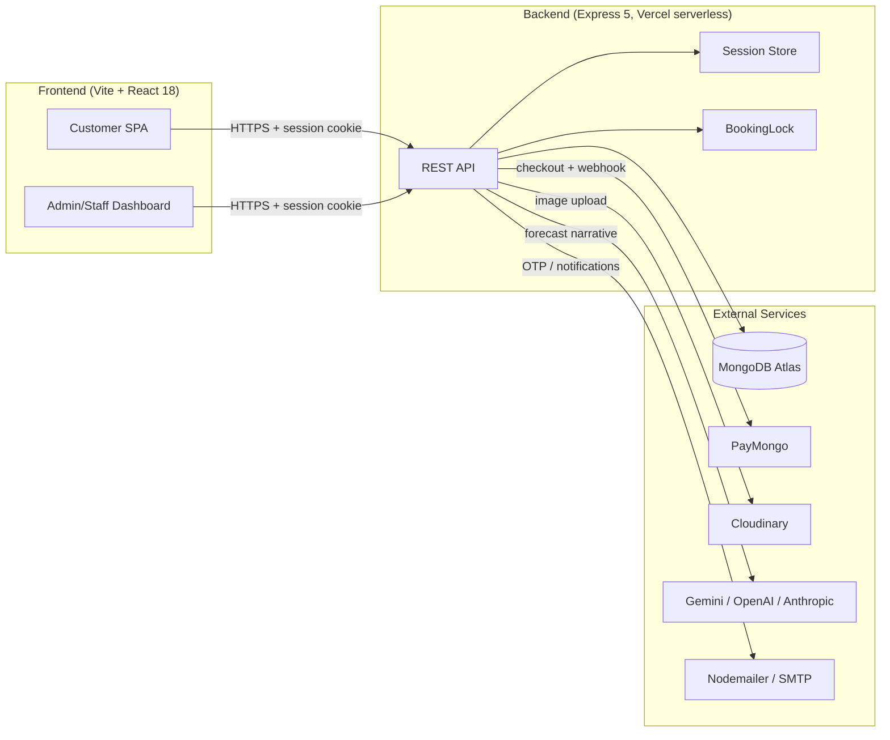
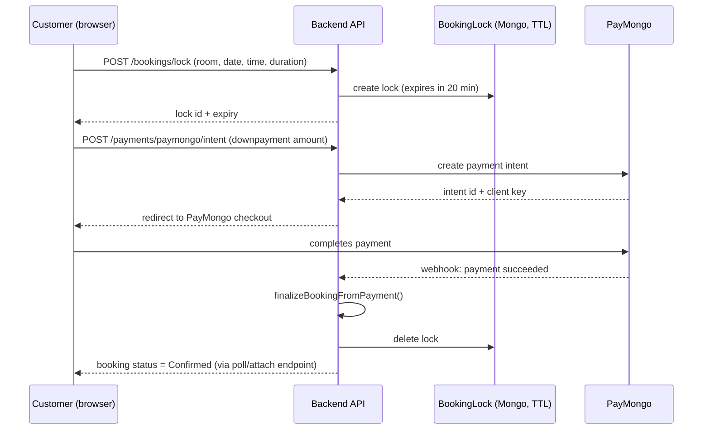
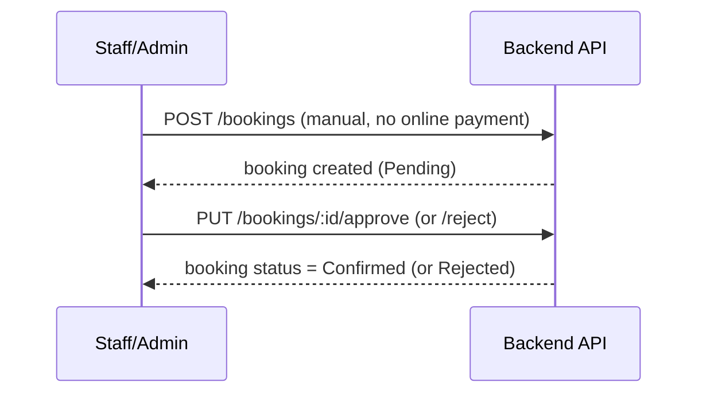
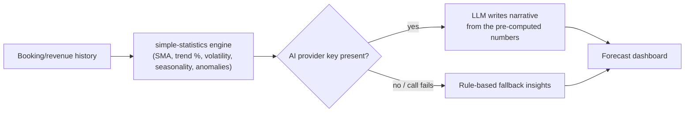

# ARCHITECTURE.md — The Riverview

This documents the system as it actually exists in code — the goal is a source of truth an agent (or a new dev) can check work against, not an aspirational diagram.

## 1. System Overview

A classic three-tier web app, deployed serverless:



- **Frontend**: Vite + React 18, deployed on Vercel as a static build.
- **Backend**: Express 5, deployed on Vercel as a serverless function (`api/index.js` wraps `server.js`). No persistent server process — each request is a cold-start-capable function invocation, so `connectDB()` is idempotent/cached (`isConnected` flag) rather than run once at boot.
- **Database**: MongoDB via Mongoose, also used as the **session store** (`connect-mongo`) — no separate Redis/session layer.
- **No WebSocket/SSE layer.** Real-time-feeling status updates are handled by client-side polling (see Section 4). This is a deliberate choice, not a gap — documented so no one "fixes" it into a bigger dependency without reason.

## 2. Layered Structure (backend)

```
routes/       → HTTP layer: parses request, checks permission, calls model/utils, shapes response
middleware/   → cross-cutting concerns: auth, CSRF, rate limiting, upload, input validation
model/        → Mongoose schemas — the only place data shape is defined
validation/   → Joi schemas — the only place input rules are defined
utils/        → business logic that doesn't belong to a single route (pricing, permissions, mailer, forecast narrative)
scripts/      → one-off/cron-invoked maintenance jobs, not part of the request path
```

**Rule:** business logic (pricing rules, availability checks, lock handling) belongs in `utils/`, not inlined in `routes/`. Routes should stay thin — validate, authorize, delegate, respond. `bookingHelper.js` (pricing/finalization) and `permissions.js` (RBAC) are the existing examples to follow.

## 3. Auth & Authorization

- **Session-based**, not JWT: `express-session` + `connect-mongo`, 8-hour TTL, `httpOnly`/`secure`/`sameSite:lax` cookie.
- **CSRF protection**: custom origin-verification middleware (`middleware/csrf.js`) checks request origin against an explicit allow-list — not a token-based CSRF scheme.
- **RBAC**: role hierarchy `user (0) → staff (1) → manager/"Supervisor" → super_admin/"Owner"`, defined in `utils/permissions.js`. Authorization is **permission-string based** (`booking:manage`, `reports:view`, etc.), not raw role checks — routes call `requirePermission(PERMISSIONS.X)`, so a role's access can change by editing the permission map, not the routes.
- **Rule:** new protected routes must use `requirePermission()` or `ensureAuthenticated`, never hand-roll a role check inline in a route handler.

## 4. Data Flow: Customer Booking + Payment

Two booking paths exist and both are correct — they're not in conflict:

**Path A — Online self-service (auto-confirm):**



- The lock (20-minute TTL, auto-expiring via Mongo TTL index) prevents two customers from paying for the same slot simultaneously — this is what makes "zero double-booked slots" achievable.
- If a webhook is missed/delayed, the `/intent/:id/attach` and `/status/:id` endpoints let the client actively confirm payment status as a fallback — the booking isn't left stuck on network flakiness alone.
- If payment succeeds but the slot became unavailable in the meantime (race condition), the booking is flagged for manual review/refund rather than silently created — logged server-side, not surfaced as a generic error.

**Path B — Staff/walk-in manual booking:**



## 5. Data Flow: Room/Court Status Monitoring

- Client polls `GET /monitor-rooms` and `GET /room-sessions` every **2 seconds** (`LOBBY_POLL_MS`) while the lobby/monitor view is open.
- A local 1-second tick drives visual countdowns (e.g. time remaining) between polls without hitting the server every second.
- An overdue-session alert (audible beep) re-fires at most every 30 seconds to avoid alert fatigue.
- **This is the final approach, not a placeholder.** 2-second polling meets the "near-live" requirement without the added complexity of a WebSocket/SSE layer. Do not introduce a push-based layer without a documented reason — it's not a "todo."

## 6. Data Flow: Revenue Forecasting



- **All figures are computed deterministically** by `simple-statistics` in `forecastRoutes.js` — this is the auditable, reproducible "real" forecasting logic.
- The AI (Gemini → OpenAI → Anthropic, auto-selected by whichever API key is configured) has exactly one job: turn the pre-computed JSON into a readable narrative (executive summary, recommendations, risk flags). **It never generates or alters a number.**
- If no AI key is set, or the call fails for any reason, the feature falls back to existing rule-based insights — the forecast page must never break because of the AI call.
- **Rule:** any change to forecast math goes in the statistics layer; any change to forecast *wording* goes in the narrative prompt. Don't blur the two.

## 7. Concurrency & Data Integrity

- **BookingLock** (Section 4) is the primary double-booking defense — a MongoDB TTL-indexed document, not an in-memory lock (which wouldn't survive serverless cold starts/multiple instances).
- **Reschedule limits** (max 2, 3-hour cutoff) and **cancellation approval gating** are enforced server-side in the booking routes/model, not just in the frontend UI — the frontend should treat these as UX conveniences, not the source of truth.

## 8. Third-Party Integrations

| Service | Purpose | Notes |
|---|---|---|
| PayMongo | Downpayment checkout + webhook | Signature-verified webhook; raw body parsing required on that route only |
| Cloudinary | Image storage (rooms, uploads) | Via `multer` for upload handling |
| Gemini / OpenAI / Anthropic | Forecast narrative only | Auto-selected by available API key; never source of numeric truth |
| Nodemailer | OTP delivery, notifications | — |
| Google Auth Library | Google sign-in | — |
| ExcelJS | Exportable reports (PDF/Excel) | Backs the "exportable report" feature from DESIGN/PRD |

## 9. Security Posture

- `helmet` for HTTP security headers.
- `cors` with an explicit allow-list (`APP_BASE_URL`), not a wildcard.
- Rate limiting (`express-rate-limit`) on sensitive routes (booking actions, payment intents).
- `Joi` validation on all mutating routes via `validate()` middleware — reject malformed input before it reaches business logic.
- `bcryptjs` for password hashing.
- Audit log (`auditLog` model) and login history (`loginHistory` model) for traceability of admin actions.

## 10. Deployment

- Both Frontend and Backend deploy to **Vercel**.
- Backend is a single serverless function (`api/index.js` → `server.js`); `vercel.json` routes all paths to it.
- **Vercel Cron** runs `GET /api/cron/purge-expired-guests` daily (18:00 UTC), protected by a bearer-token secret (`CRON_SECRET`) — not a public endpoint.
- Environment-specific behavior (`trust proxy`, secure cookies) is gated on `NODE_ENV === "production"`.