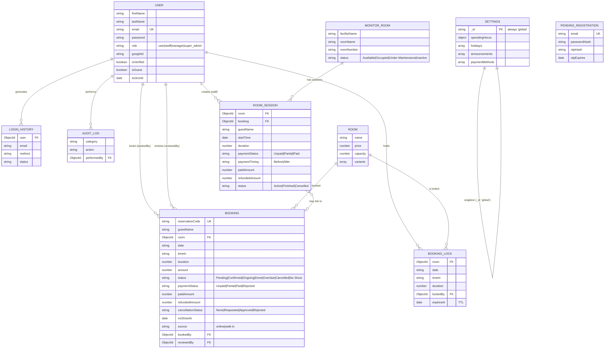

# SCHEMA.md — The Riverview

Documents the actual MongoDB/Mongoose schema as it exists in `BackEnd/model/`. This is reverse-engineered from code, not designed fresh — so it is the source of truth for persisted fields and their operational decisions.

## ✅ Resolved implementation decisions

The implementation now enforces the context decisions that affect booking, monitoring, and finance. Keep this section aligned with the models and route guards when changing the system.

1. **Reschedule cutoff:** `RESCHEDULE_CUTOFF_HOURS = 3` and `MAX_RESCHEDULES = 2` are enforced server-side.
2. **Operating hours:** the default schedule is `07:00–00:00` every day, and the Settings screen can update the singleton schedule. Existing deployments use the backed-up `align:prd:apply` migration to replace the legacy default.
3. **Cancellation and no-show:** cancellation is requested, reviewed by an admin, and manually refunded when appropriate. A missed confirmed booking becomes `No Show` after its scheduled end and forfeits the downpayment.
4. **Canonical finance:** linked booking and room-session records are folded into one ledger row; explicit payment and refund amounts drive collected and outstanding totals. Legacy `Paid` flags without an amount are review-only and are excluded from collected revenue.
5. **Partial payment:** both bookings and room sessions support `Partial`. A verified online downpayment remains a recorded payment while the rest is payable at the venue.
6. **Whole-hour operations:** booking mutations accept 1–5 whole hours; Live Monitor sessions and extensions accept 1–24 whole hours.

## 1. Entity Relationship Diagram

## 2. Collections

### User
Core account record for customers, staff, and admins alike — same model, differentiated by `role`.

| Field | Type | Notes |
|---|---|---|
| `firstName`, `lastName` | String | required |
| `email` | String | required, unique, lowercase |
| `password` | String | bcrypt-hashed, `select: false` (never returned by default queries) |
| `role` | enum | `user` (0) → `staff` (1) → `manager` ("Supervisor") → `super_admin` ("Owner") |
| `googleId` | String | sparse index — set only for Google sign-in accounts |
| `failedLoginAttempts`, `lockUntil` | — | account lockout after repeated failed logins |
| `isVerified` | Boolean | email verified via OTP |
| `isGuest`, `guestDeletedAt`, `guestRecovery*` | — | supports a guest-account flow with a recovery path (guest can later "claim" the account with a real password) |
| `resetOtp*`, `verifyOtp*` | — | password reset / email verification OTP state, all `select: false` |

**Note:** Owner and Supervisor being "basically the same access" (per PRD) is implemented as `super_admin` and `manager` being adjacent, high tiers in the same `ROLE_LEVEL` hierarchy — not a special-cased "these two are identical" rule. If a permission is ever added that should apply to one but not the other, it's a straightforward addition to `permissions.js`, not a schema change.

### Booking
The core transactional record — one per reservation, online or walk-in.

| Field | Type | Notes |
|---|---|---|
| `reservationCode` | String | required, unique, immutable |
| `room` | ObjectId → Room | required |
| `date`, `timeIn` | String | stored as plain strings, not a combined Date — avoids timezone parsing bugs |
| `duration` | Number (hours) | persisted max 24 for legacy compatibility; validated booking mutations accept 1–5 whole hours |
| `amount`, `roomCharge`, `hourlyRates[]`, `corkageFee` | Number(s) | immutable-at-payment pricing snapshot; `amount = roomCharge + corkageFee` |
| `status` | enum | `Pending`, `Pending Payment Verification`, `Awaiting Online Payment`, `Confirmed`, `Rejected`, `Ongoing`, `Done`, `Overdue`, `Cancelled`, `No Show` |
| `paymentStatus` | enum | `Unpaid`, `Partial`, `Paid`, `Rejected` |
| `source` | enum | `online` \| `walk-in` — distinguishes the two booking paths from ARCHITECTURE.md |
| `paymentProvider` | enum | `manual` \| `paymongo` |
| `paymongoPaymentIntentId` | String | unique+sparse — links to the PayMongo payment flow |
| `downPayment`, `downPaymentHours` | Number | verified online deposit and the number of hourly charges it covers |
| `paidAmount`, `refundedAmount` | Number | explicit money values used by the canonical sales ledger; finance uses the greater valid recorded value from `paidAmount`/legacy `downPayment`, then subtracts refunds |
| `cancellationStatus`, `cancellationReason`, `cancellationReview*` | — | customer request plus admin review/refund trail |
| `noShowAt` | Date | set when the scheduled end passes without completion; downpayment is forfeited |
| `rescheduleCount` | Number | capped at `MAX_RESCHEDULES = 2` (matches PRD) |
| `bookedBy`, `reviewedBy` | ObjectId → User | who created it / who approved-rejected it (walk-in path) |

Indexed on `{ room: 1, date: 1 }` — the query pattern for "what's booked on this room, this day" (availability checks) is the hot path.

### Room
Defines a bookable facility and its priced variants (e.g. Billiards' Shared/Solo/Big Room/VIP tiers).

| Field | Type | Notes |
|---|---|---|
| `name`, `price`, `capacity` | — | base facility info |
| `variants[]` | Array | each variant has its own `label`, `price`, `pax`, `roomCount`, `status` (`Available`/`Maintenance`/`Unavailable`) — **this is what makes room inventory admin-configurable**, satisfying the PRD requirement directly |
| `variants[].pricingMode` | enum | `flat` or `time-based`; time-based variants use `eveningPrice` from `eveningStartTime` |
| `variants[].includedGuests`, `variants[].extraGuestFee` | Number | optional per-guest hourly surcharge; `includedGuests = 0` applies it to every guest |

Only `Billiards`, `KTV`, and `Court` are accepted as facility names. Mutating room routes parse multipart JSON and validate the complete payload with Joi before saving.

### BookingLock
Short-lived hold on a slot during checkout — prevents double-booking. See ARCHITECTURE.md Section 4/7.

| Field | Type | Notes |
|---|---|---|
| `room`, `date`, `timeIn`, `duration` | — | identifies the slot being held |
| `lockedBy` | ObjectId → User | |
| `expiresAt` | Date | **TTL index, `expireAfterSeconds: 0`** — Mongo auto-deletes the lock at `expiresAt`, no cleanup job needed |

Lock duration: 20 minutes (`LOCK_DURATION_MINUTES`).

### MonitorRoom + RoomSession
Separate from `Room` — this is the **live operational view** staff use (Section 5 of ARCHITECTURE.md), not the customer-facing booking catalog. `MonitorRoom` is a physical unit with a live `status`; `RoomSession` is an occupancy record (who's in the room right now, since when, for how long, payment state) optionally linked back to a `Booking`. Saving a `Room` synchronizes its variant counts, number ranges, pricing, and availability state into `MonitorRoom`; active/occupied units are preserved during a sync.

Sessions retain their `paidAmount` and `refundedAmount` when finished or cancelled. The finance ledger uses a linked session's charges as the authoritative charge and includes the booking's original deposit once, preventing double counting.

| Record | Important fields | Meaning |
|---|---|---|
| `MonitorRoom` | `facilityName`, `roomName`, `roomNumber` | exact physical unit shown in Live Monitor |
| `MonitorRoom` | `price`, `pricingMode`, `eveningPrice`, `eveningStartTime` | hourly pricing copied from the admin-managed catalog |
| `MonitorRoom` | `includedGuests`, `extraGuestFee`, `pax` | capacity and per-guest pricing snapshot |
| `RoomSession` | `startTime`, `duration`, `hourlyRates[]`, `rate`, `amount`, `corkageFee` | scheduled whole-hour usage and immutable calculated charge |
| `RoomSession` | `booking` | optional reservation link used to carry its deposit and avoid duplicate ledger rows |
| `RoomSession` | `paidAmount`, `refundedAmount`, `paymentStatus`, `paymentTiming` | actual collection, balance state (`Paid`/`Partial`/`Unpaid`), and before/after-play intent |
| `RoomSession` | `status`, `endedAt`, `cancellationReason` | operational lifecycle (`Active`/`Finished`/`Cancelled`) and audit data |

### Settings (singleton)
One document only (`_id: "global"`), enforced via `getSingleton()` rather than a schema-level singleton pattern. Holds:
- `operatingHours` — business-wide hours, open days, min/max online booking duration (**currently 1–5 hours, matching PRD**)
- `holidays[]` — closure dates
- `announcements[]` — homepage banners, auto-filtered by `isActive`/`expiresAt`
- `paymentMethods[]` — customer-facing down-payment options (currently unseeded by default now that PayMongo checkout is automatic — see comment in code)

### AuditLog / LoginHistory
Append-only traceability logs. `LoginHistory` **snapshots** name/email/role at the time of the event rather than just referencing the user — so history stays accurate even after a later role change or account deletion. Both indexed on `createdAt: -1` (most-recent-first is the only real query pattern).

### PendingRegistration
Holding area for signup-in-progress until OTP verification completes; **TTL-indexed** to auto-delete abandoned signups. On success, its data is copied into a real `User` document and the pending record is deleted.

## 3. Cross-Cutting Rules

- **Dates as strings, not `Date` objects**, for anything user-facing/schedulable (`Booking.date`, `Booking.timeIn`, `Settings.holidays[].date`) — deliberate, to sidestep timezone-conversion bugs. Don't "fix" this into a `Date` type without checking every comparison that relies on string equality.
- **TTL indexes over cleanup jobs** where possible (`BookingLock`, `PendingRegistration`) — Mongo handles expiry natively; only the guest-account purge uses an actual cron job (`scripts/purgeExpiredGuests.js`), because that flow needs conditional logic TTL can't express (e.g. only guests who never converted).
- **Snapshot fields for history**, not just references (`LoginHistory.name/email/role`) — history that changes when the underlying record changes isn't real history.
- **`select: false` on all sensitive/secret fields** (password, OTP hashes, reset tokens) — they must be explicitly `.select("+password")`'d to ever appear in a query result.
