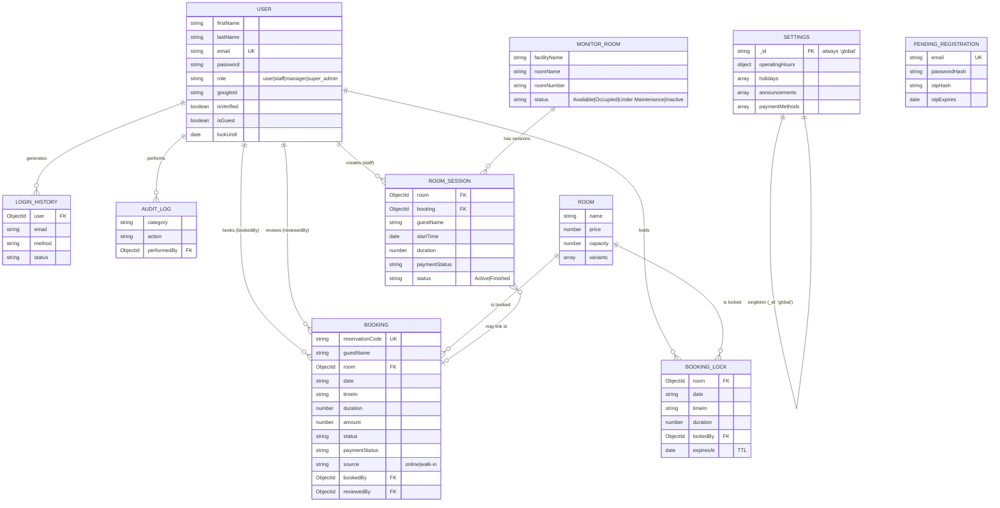

# SCHEMA.md — The Riverview

Documents the actual MongoDB/Mongoose schema as it exists in `BackEnd/model/`. This is reverse-engineered from code, not designed fresh — so it's a source of truth for what *is*, plus flags on where it disagrees with PRD.md.

## ⚠️ Known Discrepancies — Decided, Pending Code Update

These are resolved decisions, not open questions. Code has not been changed yet — flagging here so nothing "fixes" them back to the old values by accident, and so whoever picks this up (including a future Codex session) knows what to change.

1. **Reschedule cutoff:** `booking.js` currently hardcodes `RESCHEDULE_CUTOFF_HOURS = 1`. **Decision: change to 3**, to match PRD.md. → `BackEnd/model/booking.js`
2. **Operating hours vs. Court pricing:** `Settings.operatingHours` currently defaults to `06:00–22:00`. **Decision: extend to cover midnight**, so the Court pricing tier (up to 12AM) is actually reachable through the booking flow. → `BackEnd/model/settings.js` (`operatingHoursSchema` default `closeTime`), and check the live Settings document in the DB too — the schema default only applies to *new* singleton creation, not an already-existing settings document.

## 1. Entity Relationship Diagram

## 2. Collections

### User
Core account record for customers, staff, and admins alike — same model, differentiated by `role`.

| Field | Type | Notes |
|---|---|---|
| `firstName`, `lastName` | String | required |
| `email` | String | required, unique, lowercase |
| `password` | String | bcrypt-hashed, `select: false` (never returned by default queries) |
| `role` | enum | `user` (0) → `staff` (1) → `manager` ("Supervisor") → `super_admin` ("Owner") |
| `googleId` | String | sparse index — set only for Google sign-in accounts |
| `failedLoginAttempts`, `lockUntil` | — | account lockout after repeated failed logins |
| `isVerified` | Boolean | email verified via OTP |
| `isGuest`, `guestDeletedAt`, `guestRecovery*` | — | supports a guest-account flow with a recovery path (guest can later "claim" the account with a real password) |
| `resetOtp*`, `verifyOtp*` | — | password reset / email verification OTP state, all `select: false` |

**Note:** Owner and Supervisor being "basically the same access" (per PRD) is implemented as `super_admin` and `manager` being adjacent, high tiers in the same `ROLE_LEVEL` hierarchy — not a special-cased "these two are identical" rule. If a permission is ever added that should apply to one but not the other, it's a straightforward addition to `permissions.js`, not a schema change.

### Booking
The core transactional record — one per reservation, online or walk-in.

| Field | Type | Notes |
|---|---|---|
| `reservationCode` | String | required, unique, immutable |
| `room` | ObjectId → Room | required |
| `date`, `timeIn` | String | stored as plain strings, not a combined Date — avoids timezone parsing bugs |
| `duration` | Number (hours) | min ~0 (practically 1, per Settings), max 24 |
| `status` | enum | `Pending`, `Pending Payment Verification`, `Awaiting Online Payment`, `Confirmed`, `Rejected`, `Ongoing`, `Done`, `Overdue`, `Cancelled` |
| `paymentStatus` | enum | `Unpaid`, `Paid`, `Rejected` |
| `source` | enum | `online` \| `walk-in` — distinguishes the two booking paths from ARCHITECTURE.md |
| `paymentProvider` | enum | `manual` \| `paymongo` |
| `paymongoPaymentIntentId` | String | unique+sparse — links to the PayMongo payment flow |
| `rescheduleCount` | Number | capped at `MAX_RESCHEDULES = 2` (matches PRD) |
| `bookedBy`, `reviewedBy` | ObjectId → User | who created it / who approved-rejected it (walk-in path) |

Indexed on `{ room: 1, date: 1 }` — the query pattern for "what's booked on this room, this day" (availability checks) is the hot path.

### Room
Defines a bookable facility and its priced variants (e.g. Billiards' Shared/Solo/Big Room/VIP tiers).

| Field | Type | Notes |
|---|---|---|
| `name`, `price`, `capacity` | — | base facility info |
| `variants[]` | Array | each variant has its own `label`, `price`, `pax`, `roomCount`, `status` (`Available`/`Maintenance`/`Unavailable`) — **this is what makes room inventory admin-configurable**, satisfying the PRD requirement directly |

### BookingLock
Short-lived hold on a slot during checkout — prevents double-booking. See ARCHITECTURE.md Section 4/7.

| Field | Type | Notes |
|---|---|---|
| `room`, `date`, `timeIn`, `duration` | — | identifies the slot being held |
| `lockedBy` | ObjectId → User | |
| `expiresAt` | Date | **TTL index, `expireAfterSeconds: 0`** — Mongo auto-deletes the lock at `expiresAt`, no cleanup job needed |

Lock duration: 20 minutes (`LOCK_DURATION_MINUTES`).

### MonitorRoom + RoomSession
Separate from `Room` — this is the **live operational view** staff use (Section 5 of ARCHITECTURE.md), not the customer-facing booking catalog. `MonitorRoom` is a physical unit with a live `status`; `RoomSession` is an occupancy record (who's in the room right now, since when, for how long, payment state) optionally linked back to a `Booking`.

### Settings (singleton)
One document only (`_id: "global"`), enforced via `getSingleton()` rather than a schema-level singleton pattern. Holds:
- `operatingHours` — business-wide hours, open days, min/max online booking duration (**currently 1–5 hours, matching PRD**)
- `holidays[]` — closure dates
- `announcements[]` — homepage banners, auto-filtered by `isActive`/`expiresAt`
- `paymentMethods[]` — customer-facing down-payment options (currently unseeded by default now that PayMongo checkout is automatic — see comment in code)

### AuditLog / LoginHistory
Append-only traceability logs. `LoginHistory` **snapshots** name/email/role at the time of the event rather than just referencing the user — so history stays accurate even after a later role change or account deletion. Both indexed on `createdAt: -1` (most-recent-first is the only real query pattern).

### PendingRegistration
Holding area for signup-in-progress until OTP verification completes; **TTL-indexed** to auto-delete abandoned signups. On success, its data is copied into a real `User` document and the pending record is deleted.

## 3. Cross-Cutting Rules

- **Dates as strings, not `Date` objects**, for anything user-facing/schedulable (`Booking.date`, `Booking.timeIn`, `Settings.holidays[].date`) — deliberate, to sidestep timezone-conversion bugs. Don't "fix" this into a `Date` type without checking every comparison that relies on string equality.
- **TTL indexes over cleanup jobs** where possible (`BookingLock`, `PendingRegistration`) — Mongo handles expiry natively; only the guest-account purge uses an actual cron job (`scripts/purgeExpiredGuests.js`), because that flow needs conditional logic TTL can't express (e.g. only guests who never converted).
- **Snapshot fields for history**, not just references (`LoginHistory.name/email/role`) — history that changes when the underlying record changes isn't real history.
- **`select: false` on all sensitive/secret fields** (password, OTP hashes, reset tokens) — they must be explicitly `.select("+password")`'d to ever appear in a query result.